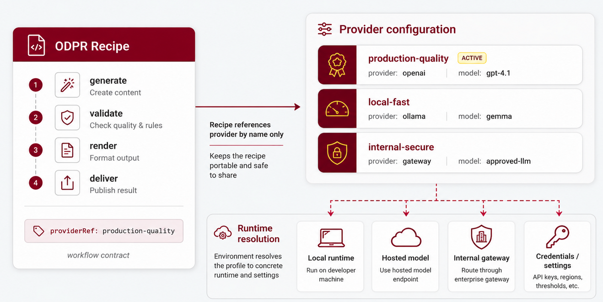

# OPEN DATA PRODUCT RECIPE SPECIFICATION - The Linux Foundation

## Version DRAFT

The key words "MUST", "MUST NOT", "REQUIRED", "SHALL", "SHALL NOT", "SHOULD",
"SHOULD NOT", "RECOMMENDED", "NOT RECOMMENDED", "MAY", and "OPTIONAL" in this
document are to be interpreted as described in BCP 14
([RFC 2119](https://datatracker.ietf.org/doc/html/rfc2119) and
[RFC 8174](https://datatracker.ietf.org/doc/html/rfc8174)) when, and only when,
they appear in all capitals, as shown here.

The specification is shared under <a href='https://www.apache.org/licenses/LICENSE-2.0'>Apache 2.0</a> license.
Development of the specification is under the umbrella of the Linux Foundation.

| Topic | Link | Description |
|---|---|---|
| Version source | <a href="https://github.com/Open-Data-Product-Initiative/odpr-v1.0">Data Product Recipe Specification on GitHub</a> | Official source repository for the ODPR specification |
| Knowledge Base | [Open Data Product Spec Family Knowledge Base](https://opendataproducts.org/howto/) | Practical examples, FAQs, and implementation guidance |
| Contribute | [Raise an issue in GitHub](https://github.com/Open-Data-Product-Initiative/odpr-v1.0/issues) | Submit issues or suggestions to the specification maintainers |

# Introduction

The Data Product Recipe Specification, ODPR, is a lightweight, vendor-neutral,
machine-readable recipe model for repeatable data product delivery workflows.

ODPR is part of the OpenDataProducts.org standards family. It complements the
Open Data Product Specification, ODPS, Open Data Product Catalogs, ODPC, Open
Data Product Graphs, ODPG, and Open Data Product Vocabulary, ODPV, by defining
how workflows around those artifacts can be declared and automated.

ODPR standardizes how data product work gets done, not only what the final
artifact looks like.

## Why ODPR is needed

Data product work often depends on manual command sequences, scripts, notebooks,
prompts, and local habits. That creates delivery variation, makes validation
and review steps easy to skip, hides model-provider choices, and forces CI/CD
automation and AI agents to guess the intended workflow.

ODPR solves this by turning repeatable data product work into declared recipes.
A recipe describes:

* what workflow runs
* which inputs it uses
* which outputs it creates
* which steps run
* which checks or gates apply
* which context format is preferred
* which execution mode is expected
* which provider reference or provider class is used
* whether human review is required

## Core design principle

A recipe is not a script.

A recipe is a portable, declarative workflow contract. Scripts tell one tool
what to do. Recipes tell teams, tools, agents, and automation systems how a data
product workflow should run.

## Recipe and provider configuration

ODPR standardizes two clear root objects: `Recipe` and `Provider`.

A `Recipe` declares workflow intent: which steps run, which inputs and outputs
matter, which gates apply, and which provider profile should be used.

A `Provider` declares a named runtime profile: provider family, model,
provider class, endpoint reference, credentials reference, and safe default
settings such as temperature. This prevents each SDK, CI system, MCP server, or
agent runtime from inventing a different provider shape.

In an ODPR recipe, a provider is referenced by name:

```yaml
execution:
  mode: hosted
  providerRef: production-quality
```

The provider profile itself is configured outside the recipe, as a separate
ODPR `Provider` object:



```yaml
schema: https://opendataproducts.org/odpr-v1.0/schema/odpr.yaml
version: "1.0"
kind: Provider
provider:
  id: production-quality
  provider: openai
  model: gpt-4.1
  providerClass: hosted
  temperature: 0.2
```

This two-part model keeps recipes portable and safe to share. The same recipe
can use `providerRef: production-quality` in development, CI, staging, or
production while each environment resolves that reference to the right local
model, hosted model, internal gateway, credentials, and operational settings.
ODPR standardizes both the workflow contract and the provider profile shape;
the executing implementation owns runtime resolution, credentials, and provider
connectivity.

## Relationship to the standards family

The OpenDataProducts.org standards family follows a separation of concerns:

* **ODPS defines the product.**
* **ODPC defines catalogs and reusable portfolio objects.**
* **ODPG defines relationships and graphs.**
* **ODPV defines shared vocabulary and terms.**
* **ODPR defines repeatable workflows for data product delivery.**

ODPR does not define the product, catalog, graph, or vocabulary model. It
defines the workflow contract around those artifacts.

## Example recipe

```yaml
schema: https://opendataproducts.org/odpr-v1.0/schema/odpr.yaml
version: "1.0"
kind: Recipe
recipe:
  metadata:
    id: RCP-CI-001
    name:
      en: CI Validate Generated Fragments
    description:
      en: Generate and validate draft fragments during CI.
  version: "1.0.0"
  type: ci
  environment: ci
  execution:
    mode: local
    providerRef: local-fast
  context:
    format: gcf
    fallback:
      - toon
      - yaml
  steps:
    - id: generate-signals
      command: generate
      with:
        kind: signal
        input: source_docs/signals/
        output: generated/fragments/
    - id: validate-fragments
      command: validate
      with:
        input: generated/fragments/
  outputs:
    - id: generated-fragments
      path: generated/fragments/
  gates:
    - id: fragments-valid
      type: validation
      required: true
  review:
    required: false
```

This recipe declares what a CI runner or SDK executor should do when source
documents for signals change. The expected run is:

1. The executor loads the recipe and validates it against
   `https://opendataproducts.org/odpr-v1.0/schema/odpr.yaml`.
2. It reads `recipe.version: "1.0.0"` as the version of this workflow contract.
3. It sees `type: ci` and treats the recipe as an automated CI workflow, not as
   an interactive authoring or release-review workflow.
4. It reads `environment: ci` and labels the run as a CI workflow context.
5. It prepares a local execution run using the configured provider named
   `local-fast`. ODPR only stores the `providerRef`; credentials, model
   settings, command bindings, and runtime configuration stay in the executing
   SDK, CI system, MCP server, or platform.
6. It prepares recipe context in GCF format. If GCF is not available, the
   executor can fall back first to TOON and then to YAML.
7. It runs the `generate-signals` step by invoking the executor's `generate`
   operation with `kind: signal`, reading inputs from `source_docs/signals/`,
   and writing generated fragments to `generated/fragments/`.
8. It runs the `validate-fragments` step by invoking the executor's `validate`
   operation against `generated/fragments/`.
9. It exposes `generated-fragments` as the durable output path that CI jobs or
   agents can inspect after the run.
10. It evaluates the `fragments-valid` validation gate. Because the gate is
   required, failed validation means the CI workflow fails.
11. It does not pause for manual review after the gate passes, because
   `review.required` is `false`.

## Specification aims

ODPR aims to:

* make data product workflows portable, repeatable, inspectable, and
  automation-ready
* support standard development, CI, release, localization, hybrid, and
  agent-safe workflows
* let teams switch between local, hosted, and hybrid model execution
* standardize provider profile shape without storing raw secrets or defining
  provider-specific APIs
* support compact context policy such as YAML, TOON, GCF, or automatic fallback
* expose safe workflows to AI agents before they run tools

**Note!** In "Open Data Product" the focus is on the latter words and the
prefix "open" refers to the openness of the standard. Any connotations to open
data are not intentional, intended, or desirable.
