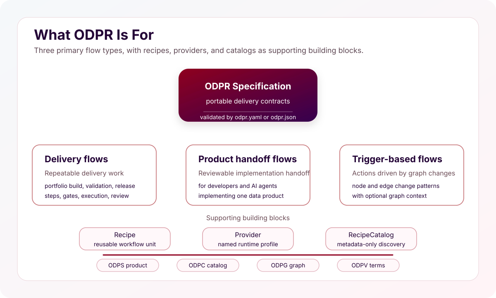
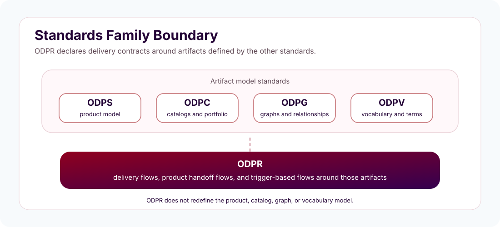

# OPEN DATA PRODUCT RECIPE SPECIFICATION - The Linux Foundation

## Version DRAFT

The key words "MUST", "MUST NOT", "REQUIRED", "SHALL", "SHALL NOT", "SHOULD",
"SHOULD NOT", "RECOMMENDED", "NOT RECOMMENDED", "MAY", and "OPTIONAL" in this
document are to be interpreted as described in BCP 14
([RFC 2119](https://datatracker.ietf.org/doc/html/rfc2119) and
[RFC 8174](https://datatracker.ietf.org/doc/html/rfc8174)) when, and only when,
they appear in all capitals, as shown here.

The specification is shared under <a href='https://www.apache.org/licenses/LICENSE-2.0'>Apache 2.0</a> license.
Development of the specification is under the umbrella of the Linux Foundation.

| Topic | Link | Description |
|---|---|---|
| Version source | <a href="https://github.com/Open-Data-Product-Initiative/odpr-v1.0">Data Product Recipe Specification on GitHub</a> | Official source repository for the ODPR specification |
| Knowledge Base | [Open Data Product Spec Family Knowledge Base](https://opendataproducts.org/howto/) | Practical examples, FAQs, and implementation guidance |
| Contribute | [Raise an issue in GitHub](https://github.com/Open-Data-Product-Initiative/odpr-v1.0/issues) | Submit issues or suggestions to the specification maintainers |

# Introduction

**The Data Product Recipe Specification, ODPR, is a lightweight, vendor-neutral,
machine-readable standard for repeatable data product delivery.**

ODPR is part of the OpenDataProducts.org standards family. It complements the
Open Data Product Specification, ODPS, Open Data Product Catalogs, ODPC, Open
Data Product Graphs, ODPG, and Open Data Product Vocabulary, ODPV, by defining
how delivery work around those artifacts can be declared, discovered,
configured, validated, reviewed, and handed off.

ODPR standardizes how data product work gets done, not only what the final
artifact looks like.

**ODPR has three primary composite flows.** It defines delivery flows for
repeatable work such as portfolio building and release validation. It defines
product handoff flows for developers and AI agents implementing one data
product. It defines trigger-based flows, where graph changes can make declared
work applicable.

**Recipes, runtime profiles, and recipe catalogs are supporting building blocks.**
Recipes describe the reusable workflow unit. Runtime profiles let recipes
reference approved LLM or model runtime configuration without embedding
credentials, endpoints, or model settings in the recipe. Catalogs help teams
and agents discover available recipes.

## What ODPR defines

* define delivery flows for repeatable data product work
* define product handoff flows for one data product
* define trigger-based flows driven by graph changes
* support those flows with recipes, runtime profiles, recipe catalogs, context
  policy, gates, and review expectations

**Note!** In "Open Data Product" the focus is on the latter words and the
prefix "open" refers to the openness of the standard. Any connotations to open
data are not intentional, intended, or desirable.

### Why ODPR is needed

Data product work often depends on manual command sequences, scripts, notebooks,
prompts, and local habits. That creates delivery variation, makes validation
and review steps easy to skip, hides model-provider choices, and forces CI/CD
automation and AI agents to guess the intended workflow.

ODPR solves this by giving teams and tools three composite flow contracts:
delivery flows, product handoff flows, and trigger-based automation
boundaries. A recipe building block describes:

* what workflow runs
* which inputs it uses
* which outputs it creates
* which steps run
* which checks or gates apply
* which context format is preferred
* which execution mode is expected
* which runtime reference is expected
* whether human review is required

### Primary flow types

ODPR has three root-level flow types.

**1. Delivery flows** declare repeatable work such as portfolio building, validation,
localization, publishing, and release review.

**2. Product handoff flows** declare the reviewable handoff for developers and AI
agents implementing one data product.

**3. Trigger-based flows** declare when graph changes can make work applicable. They
use triggers and graph context, while ODPG remains the graph source of truth.

Recipes, runtime profiles, and recipe catalogs support these flows. They are
part of ODPR v1 because flows need reusable workflow units, runtime references,
and discovery, but they are not the main reason the specification exists.

### Supporting functions

`Recipe`, `RuntimeProfile`, and `RecipeCatalog` are support building blocks for the
three flow types. Their detailed YAML structures are described after the flow
sections.

### Relationship to the standards family

The OpenDataProducts.org standards family follows a separation of concerns:

* ODPS defines the product.
* ODPC defines catalogs and reusable portfolio objects.
* ODPG defines relationships and graphs.
* ODPV defines shared vocabulary and terms.
* ODPR defines delivery flows, product handoff flows, and trigger-based flows
  around those artifacts.

ODPR does not define the product, catalog, graph, or vocabulary model. It
defines delivery workflow and handoff contracts around those artifacts.

### Reading order

Read the three flow sections first: Delivery Flows, Product Handoff Flows, and
Trigger-Based Flows. Then use the support sections for the reusable YAML
building blocks: Recipe, RuntimeProfile, and RecipeCatalog.
